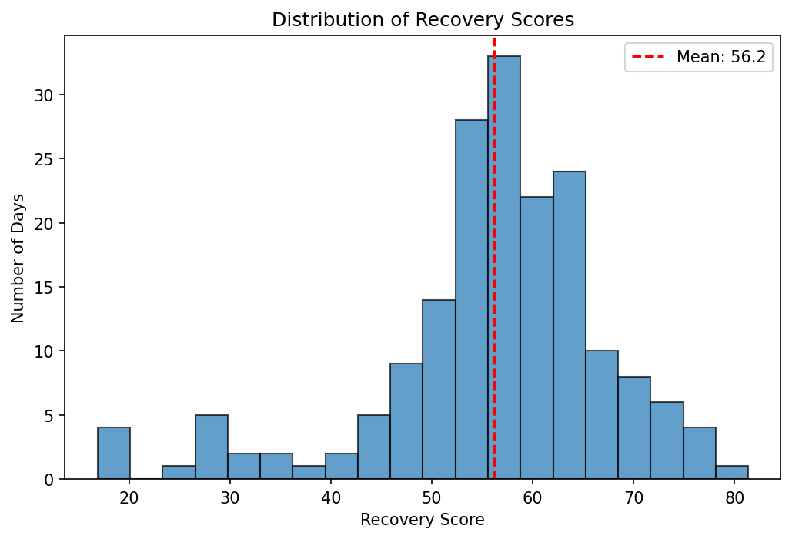

# Recovery Score Algorithm

A recovery score model built from Fitbit sleep, heart rate, and activity data. Inspired by recovery metrics used by biomarker companies like Whoop, Oura, and similar wearable platforms.

## Background

Companies like Whoop and Oura built entire products around just a single number, recovery and readiness scores. They estimate how prepared your body is for strain that day. As an Exercise Science + Data Science student interested in this space, I wanted to understand and build a simplified version of that system myself with real physiological reasoning.

## Data Source

- **Dataset:** [Fitbit Fitness Tracker Data](https://www.kaggle.com/datasets/arashnic/fitbit) (Kaggle, via Möbius)
- **Inputs used:** daily activity, sleep, and heart rate logs (April-May 2016)
- **Final dataset:** 181 user-days with complete activity, sleep, and heart rate data

## Methodology

### Data Processing
- Aggregated 2.5M+ raw heart rate readings (logged every 5 seconds) into a daily resting heart rate proxy per user, using the 5th percentile of readings per day (a robust stand-in for true resting heart rate, since the dataset lacks sleep-stage-tagged data to isolate deep sleep specifically)
- Merged activity, sleep, and heart rate data on user ID +  date (inner join across all three),  resulting in 181 clean user ID + date

### Score Design
The recovery score combined three inputs, each normalized to a 0-100 scale:

| Input | Weight | Reasoning |
|---|---|---|
| Sleep Duration | 50% | Treated as the primary mechanism of recovery — most physical restoration happens during sleep |
| Resting Heart Rate | 35% | A downstream physiological indicator that recovery occurred, weighted second since it reflects recovery rather than driving it |
| Sedentary Minutes | 15% | Minor factor — included based on a prior finding that sedentary time was linked to shorter sleep, but treated as the weakest signal |

Sleep duration and heart rate were normalized so that **higher sleep = higher score** and **lower resting heart rate = higher score** (inverted scale), based on standard exercise physiology principles. Sedentary minutes were also inverted (less sitting = higher score).

**Tools:** Python, pandas, numpy, matplotlib, scipy

## Validation

The resulting scores show a healthy, roughly normal distribution (mean = 56.2, std = 11.5) across 181 days, with no artificial clustering at either extreme.

**Top and bottom scoring days confirmed the formula behaves as expected:**
- Best scoring days ranged from 75-81 and combined long sleep (549-775 min) with low resting HR (43-59 bpm)
- Worst scoring days went as low as 17 and combined very short sleep (77-123 min) with elevated resting HR (65-70 bpm)

**Correlation check:** confirmed all three inputs meaningfully contribute to the final score (correlations of 0.88, 0.68, and 0.54 with sleep, sedentary, and RHR respectively) - no single input dominates the formula, despite differences in assigned weight. Notably, a variable's real world influence on the score depends both its weight and how much it naturally varies day to day. Resting heart rate, despite its 35% weight, showed less pull than sedentary minutes (15% weight) because RHR varied less across days in this dataset.

## Interactive Score Function

Built a reusable function that calculates a recovery score and category (Poor/Fair/Good/Excellent) from any three inputs - sleep minutes, resting HR, and sedentary minutes - not limited to users already in the dataset. This makes the score genuinely usable and understandable as a standalone tool, not just a static analysis.

## Limitations

- Small sample (181 days across ~24 users) from a single ~1-month window
- No true heart rate variability (HRV) data available - used RHR as a proxy, though HRV is the more precise recovery metric used by most wearable companies
- Weighting scheme (50/35/15) is reasoned from exercise physiology principle, not empirically derived or validated against ground-truth recovery outcomes
- Score category boundaries (65/45/25) were chosen to roughly match the observed score distribution, not derived from external validation
- Normalization ranges are based on this specific dataset - inputs far outside the observed range could produce scores outside the intended 0-100 bounds

## Future Work

- Validate weighting choices against a larger dataset or published recovery-outcome research
- Incorporate heart rate variability if a dataset with beat to beat interval data becomes available
- Build a simple web interface so the score function is usable without running code
- Test whether the score predicts next-day performance metrics

---
**Author:** Eric Gomez | Exercise Science + Data Science | [GitHub](https://github.com/eric-gomez-sportssci)

  
